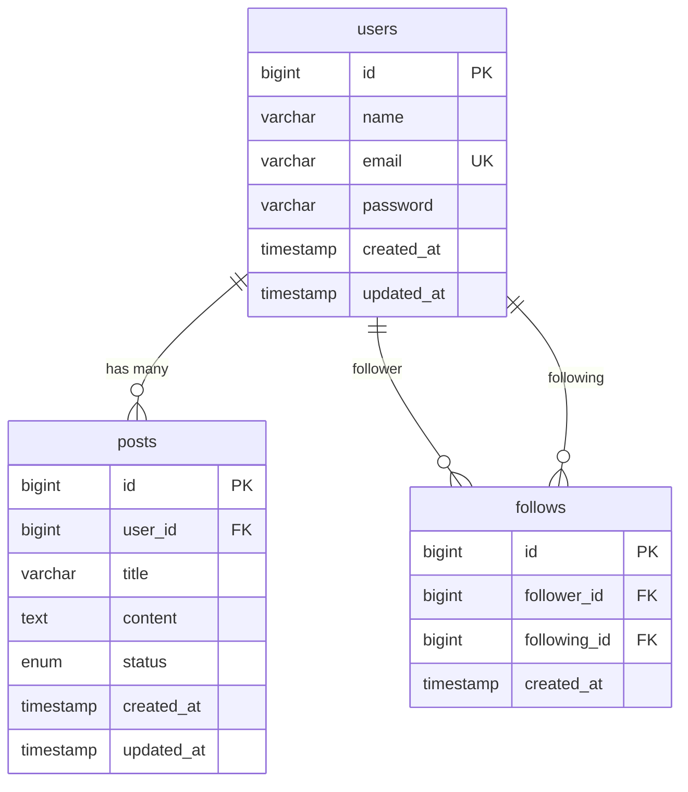

# テーブル設計書

## 📊 データベース概要

| 項目 | 内容 |
|------|------|
| データベース名 | project_db |
| 文字コード | UTF-8 |
| 照合順序 | utf8mb4_unicode_ci |
| ストレージエンジン | InnoDB |

## 📋 テーブル一覧

### users テーブル
ユーザー情報を管理するテーブル

| カラム名 | データ型 | NULL | キー | デフォルト | 説明 |
|---------|---------|------|------|-----------|------|
| id | BIGINT | NO | PRI | AUTO_INCREMENT | ユーザーID |
| name | VARCHAR(255) | NO | | | ユーザー名 |
| email | VARCHAR(255) | NO | UNI | | メールアドレス |
| password | VARCHAR(255) | NO | | | パスワード（ハッシュ化） |
| created_at | TIMESTAMP | NO | | CURRENT_TIMESTAMP | 作成日時 |
| updated_at | TIMESTAMP | NO | | CURRENT_TIMESTAMP | 更新日時 |

**インデックス:**
- PRIMARY KEY (id)
- UNIQUE KEY (email)
- INDEX (created_at)

### posts テーブル
投稿情報を管理するテーブル

| カラム名 | データ型 | NULL | キー | デフォルト | 説明 |
|---------|---------|------|------|-----------|------|
| id | BIGINT | NO | PRI | AUTO_INCREMENT | 投稿ID |
| user_id | BIGINT | NO | MUL | | ユーザーID |
| title | VARCHAR(255) | NO | | | タイトル |
| content | TEXT | YES | | NULL | 本文 |
| status | ENUM('draft','published','archived') | NO | | 'draft' | ステータス |
| created_at | TIMESTAMP | NO | | CURRENT_TIMESTAMP | 作成日時 |
| updated_at | TIMESTAMP | NO | | CURRENT_TIMESTAMP | 更新日時 |

**インデックス:**
- PRIMARY KEY (id)
- FOREIGN KEY (user_id) REFERENCES users(id)
- INDEX (user_id, status)
- INDEX (created_at)

### follows テーブル
フォロー関係を管理するテーブル

| カラム名 | データ型 | NULL | キー | デフォルト | 説明 |
|---------|---------|------|------|-----------|------|
| id | BIGINT | NO | PRI | AUTO_INCREMENT | フォローID |
| follower_id | BIGINT | NO | MUL | | フォロワーID |
| following_id | BIGINT | NO | MUL | | フォロー対象ID |
| created_at | TIMESTAMP | NO | | CURRENT_TIMESTAMP | 作成日時 |

**インデックス:**
- PRIMARY KEY (id)
- UNIQUE KEY (follower_id, following_id)
- FOREIGN KEY (follower_id) REFERENCES users(id)
- FOREIGN KEY (following_id) REFERENCES users(id)

## 🔗 ER図

## 📝 補足事項

### 命名規則
- テーブル名: スネークケース、複数形
- カラム名: スネークケース
- インデックス名: idx_テーブル名_カラム名

### 文字コード
- データベース全体: utf8mb4
- 照合順序: utf8mb4_unicode_ci

### タイムスタンプ
- created_at: レコード作成時に自動設定
- updated_at: レコード更新時に自動更新（ON UPDATE CURRENT_TIMESTAMP）

### パフォーマンス考慮事項
- 頻繁に検索されるカラムにはインデックスを設定
- 外部キーには必ずインデックスを設定
- 大量データが予想されるテーブルはパーティショニングを検討

## 🔄 マイグレーション履歴

| バージョン | 日付 | 変更内容 | 担当者 |
|-----------|------|----------|--------|
| v1.0.0 | 2024-01-01 | 初期作成 | - |

---

最終更新日: 2024-01-01